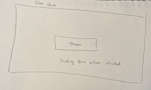
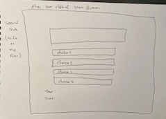
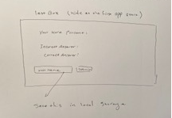

# code-quiz
create a multiple choice quiz using JavaScript, in this quiz, the user will answer six question with having to choose the correct answer out of four choices, in less than 60 seconds(10 s for each question),and showing the result at the end.

## Sketch application:

,
,

in this application we are using a boostrap CSS link and also boostrap Javascript link.